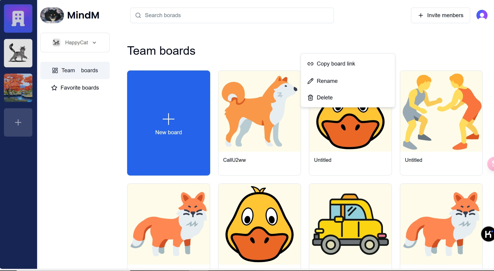
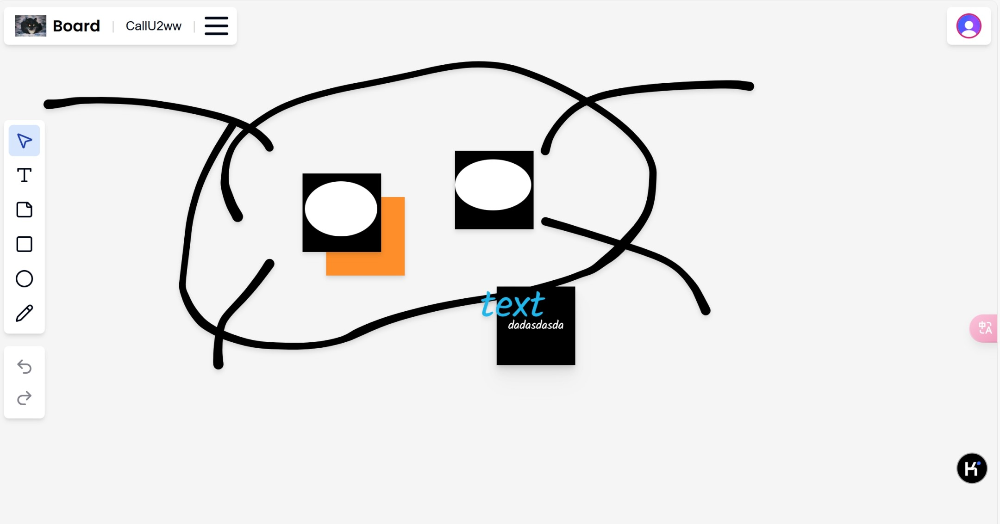
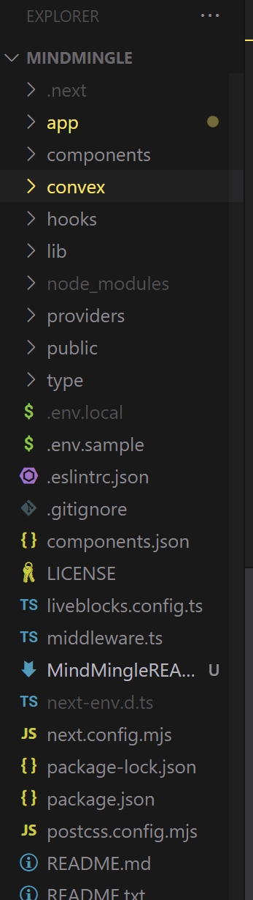

# MindMingle

## 引言：

这是一个Clone自Miro的白板协作软件

## 项目标题和描述

MindMingle 是一个基于**用户权限控制**的在线白板协作工具。用户可以创建协作白板，并邀请他人加入共同创作。

MindMingle 使用Convex做后台存储，LiveBlocks作为白板协作通信。

## 安装和使用说明

在使用之前，需要你分别配置Convex（存储协作board） 、Clerk(用户Authentication)、LiveBlocks(白板 Collaboration)，

### 文档地址：

[ConvexDocForNextJS](https://docs.convex.dev/quickstart/nextjs)

[LiveBlocksForReact](https://liveblocks.io/docs/api-reference/liveblocks-react)

[ClerkDocForNextJS](https://clerk.com/docs/quickstarts/nextjs)

### 接下来：

#### ForDevEnv:

1.`npm i`

2.配置env.local

3.`npx convex run`

4.`npm run dev`

#### ProductionForVerCel:

参考doc:[convexProdcuti0n](https://docs.convex.dev/production/hosting/custom)[Get started with Vercel](https://vercel.com/docs/getting-started-with-vercel)

### 提供使用示例

### 项目的文件和目录结构

### 主要功能：

- 🛠️ 白板从头开始
- 🧰 带有文本、形状、便笺和铅笔的工具栏
- 🪄 分层功能
- 🎨 着色系统
- ↩️ 撤消和恢复功能
- ⌨️ 键盘快捷键
- 🤝 实时协作
- 💾 实时数据库
- 🔐 授权、组织和邀请
- ⭐️ 有利的功能
- 🌐 Next.js 14框架
- 💅 TailwindCSS & ShadcnUI 造型

### 各个文件和目录的用途

convex：convex配置文件，表结构、以及一些CRUD方法

### 联系我：

如果你有任何问题，欢迎给我留言或者发邮件到[teric0898@gmail.com](mailto:teric0898@gmail.com)

### 在这里要特别感谢 Antonio 做出的巨大贡献

### 最后：祝你玩得愉快！

！

